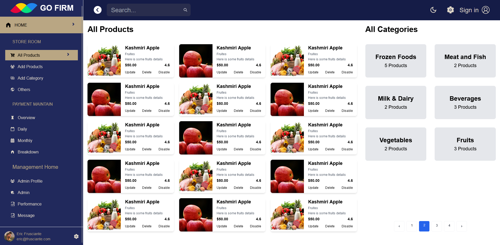

# GO-FIRM 🛒
# Backend-Code: https://github.com/Shimul-Zahan/GOFIRM-Server
# Live-link: go-firm-grocerries.netlify.app
Here is my Go Firm Grocerries Shop application.
# some images: 

**GO-FIRM** is a modern and efficient grocery e-commerce platform designed to make shopping for daily essentials easier and faster. This project includes user authentication, personalized dashboards, and seamless billing details, creating a user-friendly experience for all your grocery needs.

---

## **Features**
### 🔑 **Authentication**
- Secure user login and registration.
- Private routes to protect sensitive information.

### 📋 **Dashboard**
- Personalized dashboard for users to manage their accounts.
- View and update billing details.
- Order history and tracking.

### 🛍️ **E-Commerce**
- Browse a wide range of grocery items with an intuitive UI.
- Add products to the cart and proceed to checkout with ease.

### 🧾 **Billing**
- Automated billing details with clear and transparent information.
- Easy-to-use payment integration (future development).

### 🖥️ **Responsive Design**
- Fully responsive for both desktop and mobile users.

---

## **Tech Stack**
- **Frontend:** React.js (Components, Pages, and Shared utilities)
- **Styling:** CSS (Modular styles in `App.css` and `index.css`)
- **Routing:** React Router for private routes and navigation.
- **Backend (In Progress):** Integration planned with Node.js/Express and MongoDB.

---

## **File Structure**
The project follows a modular structure to ensure scalability and maintainability:

- **Auth/**: Handles user authentication and private routes.
- **Cards/**: Reusable components for product cards and more.
- **Dashboard/**: User dashboard implementation.
- **Main/**: Main entry point for the application structure.
- **Pages/**: All the pages like Home, Shop, About, etc.
- **Shared/**: Common utilities and shared components.
- **Version.2.0.0/**: New features and updates for the application.

---

## **Installation**
Follow these steps to set up the project locally:

1. **Clone the Repository**
   ```bash
   git clone https://github.com/Shimul-Zahan/GO-FIRM.git
